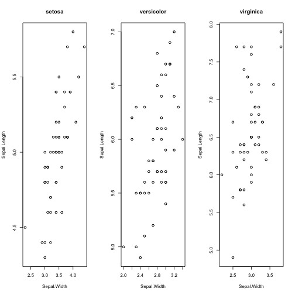

Programming in R
========================================================
author: Etienne Low-Décarie
date: November 30, 2015

Outline
========================================================

- Why programming
- Control structures
  - Loops
  - Conditions
- Functions

Why programming?
========================================================

https://www.youtube.com/user/CodeOrg

- Avoid repetitive computer tasks (ever)
- Literacy: reading code
- Considered top 10 desirable professional skill (Forbes.com)


Preperation
========================================================


```r
#install.packages("traits")
require(traits)

#install.packages("oce")
require(oce)
```


"For" loops
========================================================


```r
for(i in 1:10){
  print(i)
}
```

```
[1] 1
[1] 2
[1] 3
[1] 4
[1] 5
[1] 6
[1] 7
[1] 8
[1] 9
[1] 10
```

"For" loops
========================================================


```r
sentence <- NULL
for(words in c("This","does","not yet appear",
           "to be useful")){
  sentence <- paste(sentence,words)
}
print(sentence)
```

```
[1] " This does not yet appear to be useful"
```


"For" loops
========================================================

Get data for multiple coral species


```r
coral_trait_data <- NULL
for(taxon in 2:3){
  print(taxon)
  coral_trait_data_temp <- coral_taxa(taxon)
  coral_trait_data <- rbind(coral_trait_data,coral_trait_data_temp)
}
```

```
[1] 2
[1] 3
```

```r
print(unique(coral_trait_data$specie_name))
```

```
[1] "Homophyllia bowerbanki" "Acanthastrea brevis"   
```

Exercise 1
========================================================

using the `iris` data and `for` loops
produce a plot of sepal lenght as a function
of sepal width for each species

Exercise 1
========================================================


```r
par(mfrow=c(1,3))
for(Selected_Species in unique(iris$Species)){
 plot(Sepal.Length~Sepal.Width,
      data=iris[iris$Species==Selected_Species,],
      main=Selected_Species)
}
```

 


Other loops
========================================================

`while` loop

```r
i=0
while(i<10){
  i <- i+1
  print(i)
}
```

```
[1] 1
[1] 2
[1] 3
[1] 4
[1] 5
[1] 6
[1] 7
[1] 8
[1] 9
[1] 10
```


`If`
========================================================

```r
for(i in 1:10){
  if(i>5){
    print(i)
  }else{
    print("Too small")
  }
}
```

```
[1] "Too small"
[1] "Too small"
[1] "Too small"
[1] "Too small"
[1] "Too small"
[1] 6
[1] 7
[1] 8
[1] 9
[1] 10
```
