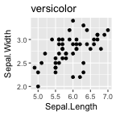
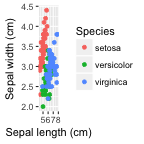

Programming in R
========================================================
author: Etienne Low-Décarie
date: December 5, 2017


Activity 1
========

Click on bunny
https://www.google.co.uk/?doodle=32615474

<iframe src=https://www.google.co.uk/?doodle=32615474></iframe>


Outline
========================================================

- Why programming
- Control structures
  - Loops
  - Conditions
- Functions

Why programming?
========================================================

https://www.youtube.com/user/CodeOrg

- Avoid repetitive computer tasks (ever)
- Literacy: reading code
- Considered top 10 desirable professional skill (Forbes.com)


Preperation
========================================================


```r
#install.packages("traits")
require(traits)

#install.packages("oce")
require(oce)
```


"For" loops
========================================================


```r
for(i in 1:10){
  print(i)
}
```

```
[1] 1
[1] 2
[1] 3
[1] 4
[1] 5
[1] 6
[1] 7
[1] 8
[1] 9
[1] 10
```

"For" loops
========================================================


```r
sentence <- NULL
for(words in c("This","does","not yet appear",
           "to be useful")){
  sentence <- paste(sentence,words)
}
print(sentence)
```

```
[1] " This does not yet appear to be useful"
```


"For" loops
========================================================

Get data for multiple coral species


```r
coral_trait_data <- NULL
for(taxon in 2:3){
  print(taxon)
  coral_trait_data_temp <- coral_taxa(taxon)
  coral_trait_data <- rbind(coral_trait_data,coral_trait_data_temp)
}
```

```
[1] 2
[1] 3
```

```r
print(unique(coral_trait_data$specie_name))
```

```
[1] "Homophyllia bowerbanki" "Acanthastrea brevis"   
```

Exercise 1
========================================================

using the `iris` data and `for` loops
produce a plot of sepal lenght as a function
of sepal width for each species

Exercise 1
========================================================


```r
for(Selected_Species in unique(iris$Species)){
  
 p <- qplot(data=iris[iris$Species==Selected_Species,],
       x=Sepal.Length,
       y=Sepal.Width,
      main=Selected_Species)
 print(p)
}
```




Other loops
========================================================

`while` loop

```r
i=0
while(i<10){
  i <- i+1
  print(i)
}
```

```
[1] 1
[1] 2
[1] 3
[1] 4
[1] 5
[1] 6
[1] 7
[1] 8
[1] 9
[1] 10
```


`If`
========================================================

```r
for(i in 1:10){
  if(i>5){
    print(i)
  }else{
    print("Too small")
  }
}
```

```
[1] "Too small"
[1] "Too small"
[1] "Too small"
[1] "Too small"
[1] "Too small"
[1] 6
[1] 7
[1] 8
[1] 9
[1] 10
```


Functions
========================================================

```r
print_name <- function(name_to_print="Etienne"){
 print(name_to_print) 
}

print_name()
```

```
[1] "Etienne"
```

```r
print_name("Julie")
```

```
[1] "Julie"
```

Exercise 2
========================================================

-   create a function that has an argument called `data`, with default value `iris`, a second argument called `organ` that will produce a plot of length vs width, with appropriate axis labels
-  try to use if statement within the function   
-  apply this function with values of "sepals" and "petals" for the argument "organ" 
- bonus= use this function in the for loop in Exercise 1 to produce a plot of each organ for each species


Exercise 2
========================================================


```r
plot_organ <- function(data=iris,
                       organ){
  if(organ == "sepals"){
    p <- qplot(data=data,
               x=Sepal.Length,
               xlab="Sepal length (cm)",
               y=Sepal.Width,
               ylab="Sepal width (cm)",
               colour=Species)
  }
    if(organ == "petals"){
    p <- qplot(data=data,
               x=Petal.Length,
               xlab="Petal length (cm)",
               y=Petal.Width,
               ylab="Petal width (cm)",
               colour=Species)
    }

  return(p)
  
}
```


Exercise 2
========================================================


```r
plot_organ(organ= "sepals")
```



```r
plot_organ(organ= "petals")
```


Exercise 2 Bonus
========================================================


```r
for(Selected_Species in unique(iris$Species)){
  
p <- plot_organ(data=iris[iris$Species==Selected_Species,],
           organ= "sepals")
print(p)
p <- plot_organ(data=iris[iris$Species==Selected_Species,],
           organ= "petals")
print(p)
}
```


